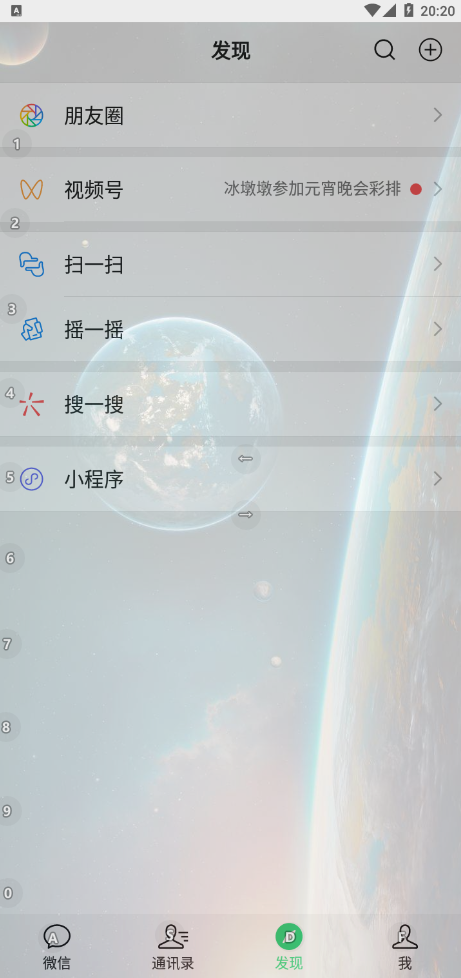

## 一、前言

BlueGrape是一个透明壁纸软件。它可以为你的APP创建透明壁纸，比如微信和QQ。

效果：

建议选择长宽比例与手机屏幕一致的图片，获得更好的效果。

1.0.5版本开始，BlueGrape壁纸将会支持视频。

## 二、安装

请访问[BlueGrape官网](https://cyrxdzj.github.io/BlueGrapeWeb/)或[发行版](https://gitee.com/cyrxdzj/BlueGrape/releases)以下载安装。

## 三、使用

#### 1、请授予权限

第一次启动BlueGrape时会有一个提示框，请求获取外部存储权限、无障碍权限和在其它应用上层显示内容权限。这些是BlueGrape运行的必要权限，请点击OK后授权。

另外，无障碍权限和在其它应用上层显示内容权限可能被系统自动关闭。若壁纸不生效，可以在设置里检查这2个权限是否打开。若关闭，则打开权限。也可以重启BlueGrape。

如果还是不生效，可以关闭BlueGrape的“无障碍”权限，再打开。

#### 2、管理我的壁纸

点击“我的壁纸”，可以看到壁纸列表（可能为空）。

#### 3、编辑壁纸内容（图片/视频）

点击“新建图片壁纸”或“新建视频壁纸”以新建一个壁纸。点击壁纸列表中的某一项，可以编辑这个壁纸。

这是编辑区：

点击“选择图片”或“选择视频”以选择壁纸使用的图片/视频。建议选择长宽比例与手机屏幕一致的图片/视频，获得更好的效果。

在“壁纸名”中编辑壁纸的名字。建议不要使用过长的名字，以免程序崩溃。

拖动“不透明度”滑动条，调整壁纸的不透明度。最高可以调整至50%，建议调整至25%，也可以根据个人喜好调整。

“壁纸填充方法”指的是壁纸宽度等于屏幕宽度（左右填充）还是壁纸长度等于屏幕长度（上下填充）。

“壁纸位置”指的是壁纸在屏幕上的位置。当“壁纸填充方法”为“左右填充”时，“右/下位置”其实等于“下方位置”，因为此时壁纸宽度等于屏幕宽度，左边还是右边没有区别。以此类推。

记得点击“保存壁纸”以保存。

### 4、关于HTML壁纸

HTML壁纸是一种动态壁纸，主要受LivelyWallpaper这款Windows应用启发。基本原理是在应用上覆盖一层半透明的WebView（应用内置浏览器组件），在WebView里显示可以变化的HTML，以达到动态壁纸的效果。

您可以在壁纸列表页面中点击“新建HTML壁纸”，然后输入壁纸压缩文件的网址（壁纸制作者应该会提供）。壁纸下载完毕后，您就可以使用了。

目前手机端暂不支持编辑它的内容。

#### 5、应用壁纸

点击“应用壁纸”后，请点击具体的APP，然后点击“确认应用”。显示绿色字体“已被应用”的，是已经或即将被应用的APP。将所有APP置为“未被应用”，相当于取消壁纸应用。

注意，此列表默认不会显示系统应用和输入法（申请输入法权限的应用）。

一个APP只能被应用一个壁纸。若这个APP已被其它壁纸应用，则会取消其它壁纸对这个APP的应用（但不会取消对其它APP的应用）。

#### 6、删除壁纸

点击“删除壁纸”后，此壁纸将被删除**并不可撤销**，同时取消此壁纸的应用关系。

#### 7、查看当前使用的壁纸

“当前使用的壁纸”显示了哪个壁纸被应用了，短按查看此壁纸具体被应用到了哪个APP上，长按可取消应用。

#### 8、停止运行

BlueGrape采用Service运行，直接退出应用或清除后台运行可能并不能真正退出。请点击“停止运行”按钮以退出。

## 四、赞赏与贡献

如果您认为此项目不错，给个Star并赞赏一下呗~

您可以[提交ISSUE](https://gitee.com/cyrxdzj/BlueGrape/issues)以帮助我们修复问题，或提出改进建议。

您也可以将本项目克隆到本地，再进行修改后提交Pull Requests。

祝您使用愉快！

开源不易，赞赏一下呗~

